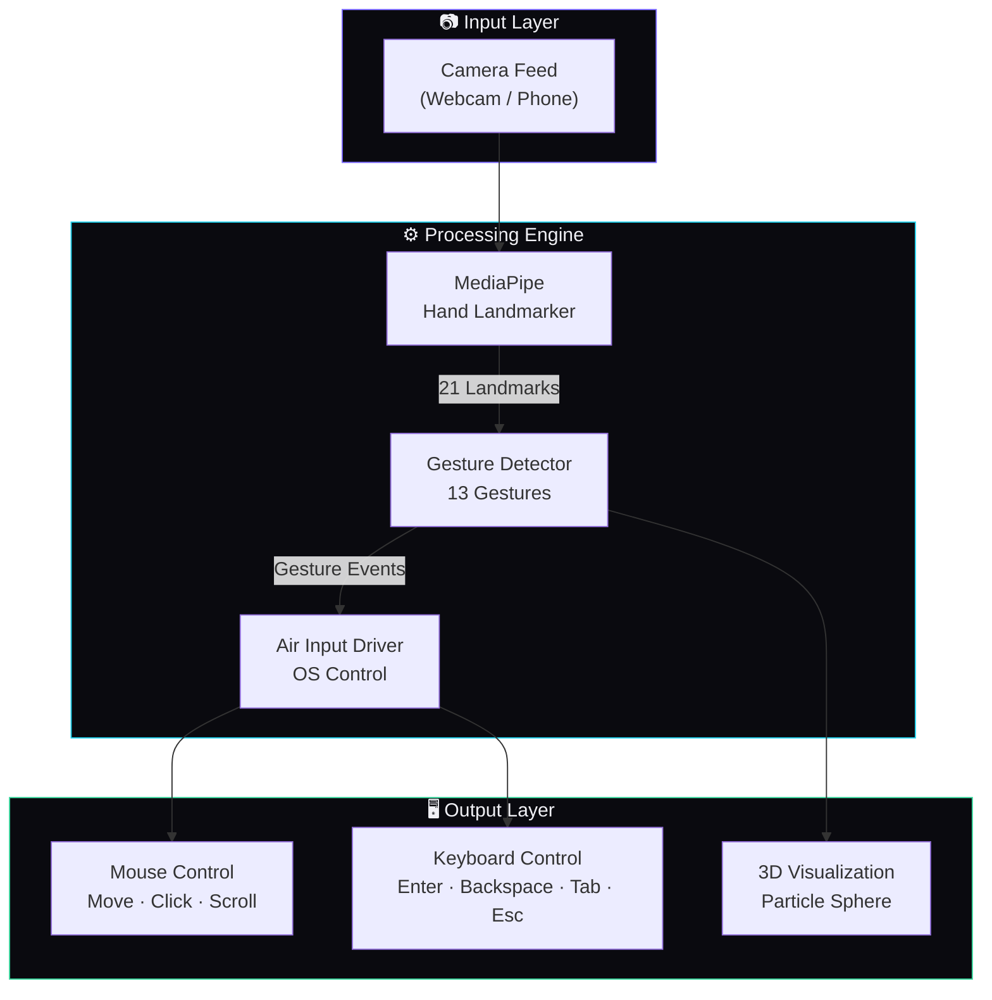
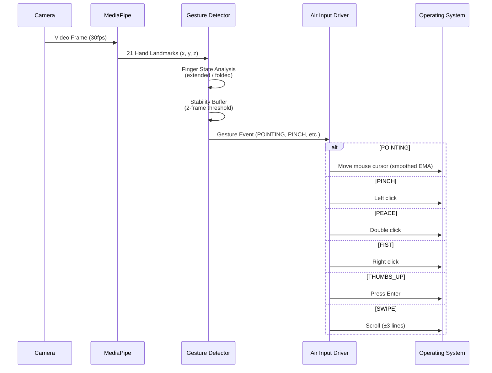
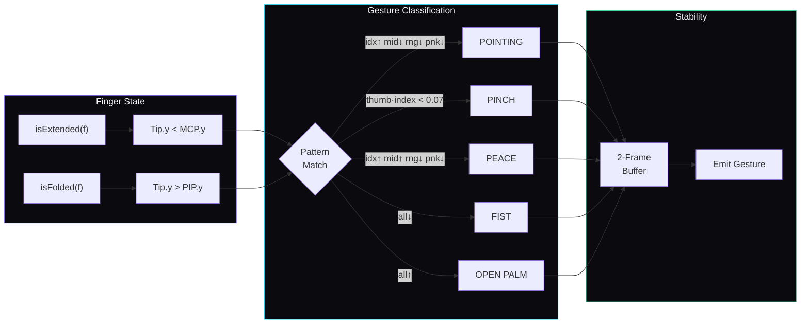
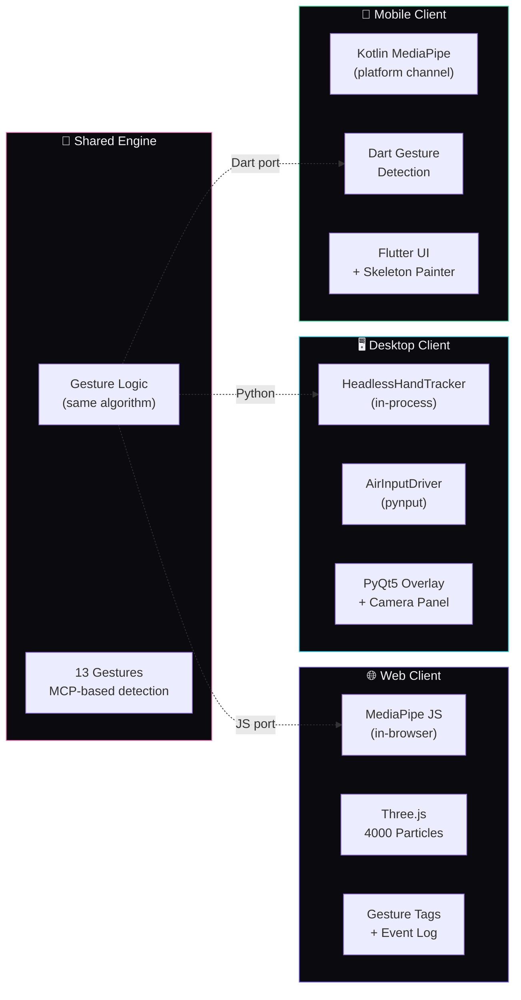
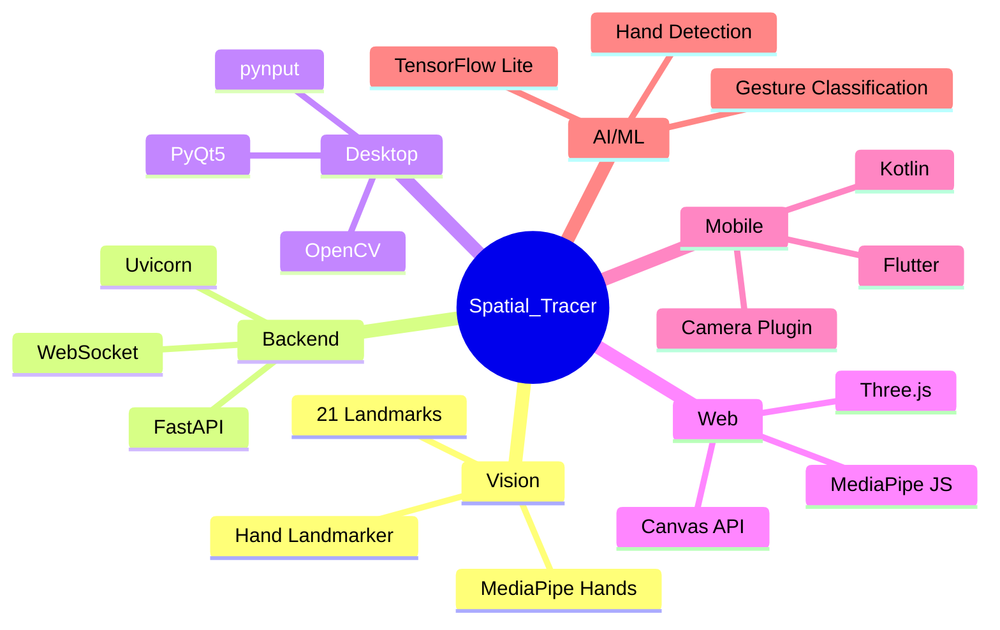
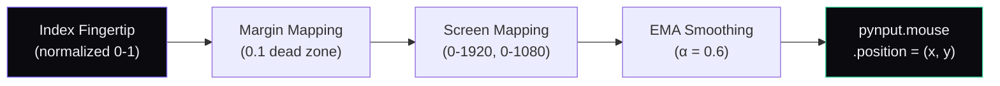

<div align="center">

# `Spatial_Tracer`

**Vision Tracking Engine — Air Gesture Control System**

[](LICENSE)
[](https://python.org)
[](https://flutter.dev)
[](https://mediapipe.dev)

*Control your computer and phone with nothing but your hands.*
*No hardware. No gloves. Just a camera.*

---

</div>

## What is Spatial_Tracer?

Spatial\_Tracer is a multi-platform air gesture engine that turns your hand movements into real input — mouse cursor control, clicks, keystrokes, and scrolling — using only a standard webcam or phone camera.

It ships as three clients:

| Platform | Stack | What It Does |
|----------|-------|-------------|
| **Web** | MediaPipe JS · Three.js | In-browser gesture demo with 3D particle visualization |
| **Desktop** | PyQt5 · pynput · MediaPipe Tasks | Transparent overlay that controls your OS mouse & keyboard |
| **Android** | Flutter · Kotlin · MediaPipe Tasks | Mobile gesture recognition with camera feed |

---

## Architecture



---

## System Flow



---

## Gesture Map

```
┌─────────────────────────────────────────────────────────┐
│  GESTURE          │  ACTION            │  COLOR         │
├───────────────────┼────────────────────┼────────────────┤
│  POINTING         │  Move cursor       │  ● #34d399     │
│  PINCH            │  Left click        │  ● #fbbf24     │
│  PEACE            │  Double click      │  ● #7c6aff     │
│  FIST             │  Right click       │  ● #ef4444     │
│  THUMBS UP        │  Enter key         │  ● #34d399     │
│  THUMBS DOWN      │  Backspace key     │  ● #f472b6     │
│  THREE            │  Tab key           │  ● #a393ff     │
│  ROCK             │  Escape key        │  ● #fbbf24     │
│  OPEN PALM        │  Idle / Release    │  ● #22d3ee     │
│  OK SIGN          │  OK gesture        │  ● #38bdf8     │
│  MIDDLE FINGER    │  Middle finger     │  ● #fb923c     │
│  CALL ME          │  Call me           │  ● #22d3ee     │
│  SPIDERMAN        │  Spiderman         │  ● #f472b6     │
└───────────────────┴────────────────────┴────────────────┘
```

---

## Gesture Detection Pipeline



---

## Project Structure

```
spatial_tracer/
│
├── engine/                          # Core processing
│   ├── headless_hand_tracer.py      # MediaPipe Tasks API tracker
│   ├── simple_hand_tracer.py        # OpenCV debug view with skeleton
│   ├── gesture_detector.py          # Pinch, tap, swipe, palm detection
│   └── air_input_driver.py          # pynput mouse/keyboard control
│
├── api/                             # Server layer
│   ├── fastapi_main.py              # FastAPI + WebSocket server
│   └── input_controller.py          # Keyboard input via pynput
│
├── web-client/                      # Browser client
│   ├── index.html                   # Premium dark UI
│   ├── style.css                    # Pitch-black dev theme
│   └── app.js                       # MediaPipe JS + Three.js + gestures
│
├── desktop-client/                  # PyQt5 overlay
│   ├── app.py                       # Transparent overlay + camera panel
│   └── camera_widget.py             # Hand skeleton renderer
│
├── mobile-client/                   # Flutter Android
│   ├── lib/main.dart                # Full app (camera, gestures, UI)
│   ├── android/.../MainActivity.kt  # MediaPipe Kotlin platform channel
│   └── pubspec.yaml                 # Dependencies
│
├── config/
│   ├── hand_landmarker.task         # MediaPipe model weights
│   └── mapping.json                 # Key mapping config
│
├── main.py                          # CLI entry point
├── requirement.txt                  # Python dependencies
└── LICENSE                          # MIT
```

---

## Multi-Platform Architecture



---

## Quick Start

### Prerequisites

```bash
Python 3.10+
Flutter 3.x (for mobile)
Webcam / Camera
```

### Install

```bash
git clone https://github.com/RajTewari01/Spatial_tracer.git
cd Spatial_tracer
pip install -r requirement.txt
```

### Run

```bash
# Web client — open in browser with 3D particle demo
python main.py web

# Desktop — transparent overlay, real mouse/keyboard control
python main.py desktop

# Debug — OpenCV window with hand skeleton
python main.py debug

# Android — Flutter app
cd mobile-client && flutter run
```

---

## Tech Stack



---

## Gesture Detection — How It Works

The system uses a **two-phase approach**:

### Phase 1: Finger State Analysis

Each of the 5 fingers is classified independently:

| State | Condition | Description |
|-------|-----------|-------------|
| **Extended** | `tip.y < MCP.y` | Fingertip is above its knuckle |
| **Folded** | `tip.y > PIP.y` | Fingertip is below its middle joint |
| **Ambiguous** | Between | Partially bent — ignored to prevent false triggers |

For the **thumb**, lateral distance from the index MCP is used instead of Y-axis comparison.

### Phase 2: Pattern Matching with Priority

Gestures are checked **most-specific first**. If a specific gesture matches (like PEACE), the catch-all gestures (FIST, OPEN_PALM) are **blocked** from firing. This prevents the domination problem where generic gestures override specific ones.

A **2-frame stability buffer** prevents single-frame noise from triggering false gestures.

---

## Desktop Air Input — How Mouse Control Works



- **Smoothing**: Exponential Moving Average prevents cursor jitter
- **Margin**: 10% dead zone at screen edges for comfortable use
- **Cooldowns**: 400ms click, 150ms scroll, 500ms key — prevents accidental repeats

---

## Configuration

| Parameter | Default | Description |
|-----------|---------|-------------|
| `smoothing` | `0.4` | Cursor smoothing (0=raw, 1=frozen) |
| `margin` | `0.1` | Screen edge dead zone |
| `click_cooldown` | `0.4s` | Min time between clicks |
| `scroll_cooldown` | `0.15s` | Min time between scrolls |
| `key_cooldown` | `0.5s` | Min time between key presses |
| `modelComplexity` | `0` | MediaPipe model (0=fast, 1=accurate) |
| `maxNumHands` | `2` | Max hands to track |

---

## API Endpoints

| Endpoint | Method | Description |
|----------|--------|-------------|
| `/` | GET | Serves the web client |
| `/ws/hand-data` | WebSocket | Real-time hand landmark stream |
| `/status` | GET | Server status + active connections |

---

## Contributing

```bash
# Fork → Clone → Branch → Code → PR
git checkout -b feat/your-feature
# Make changes
git commit -m "feat: description"
git push origin feat/your-feature
```

---

## Roadmap

- [ ] Voice commands integration
- [ ] Multi-hand collaborative gestures
- [ ] Custom gesture training (record your own)
- [ ] Accessibility mode for motor-impaired users
- [ ] iOS Flutter client
- [ ] Electron desktop app

---

<div align="center">

**Built by [Biswadeep Tewari](https://github.com/RajTewari01)**

*Full-Stack & AI/ML Engineer · Python · Dart · Kotlin · JS*
*MAKAUT University, West Bengal*

`build > ship > learn > repeat`

---

MIT License · 2025-2026

</div>
