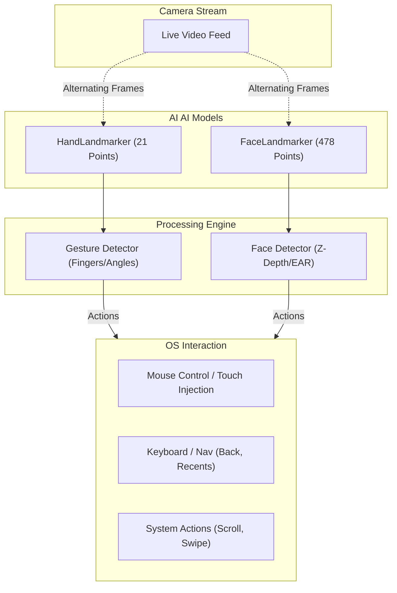
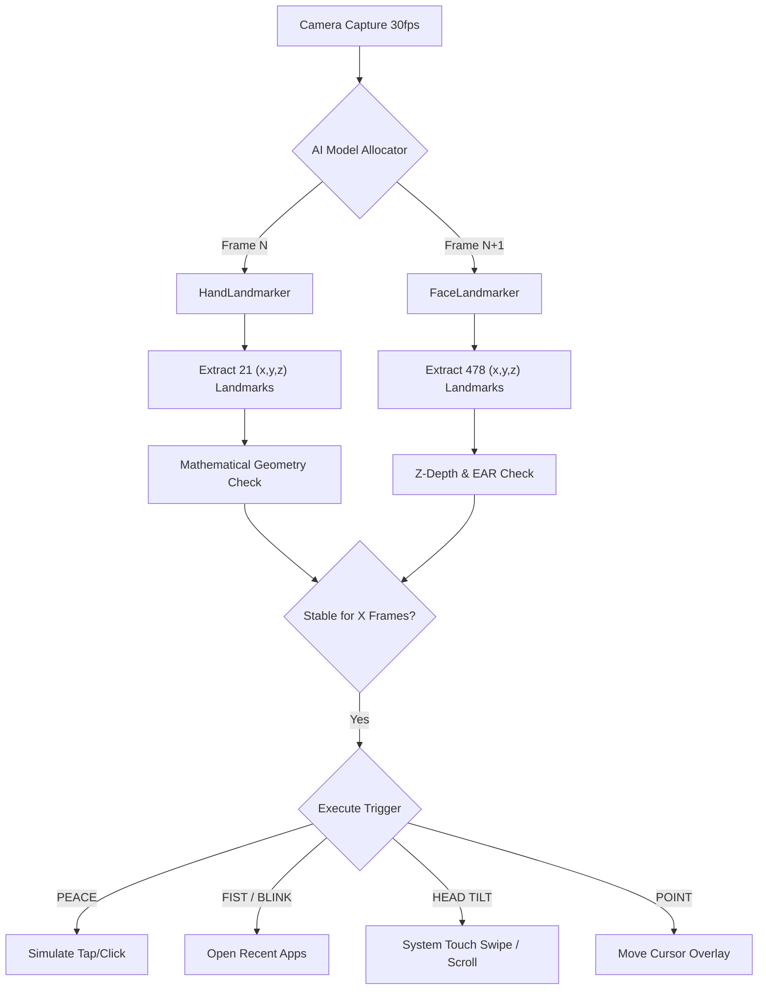
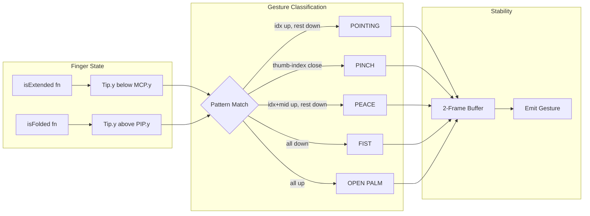
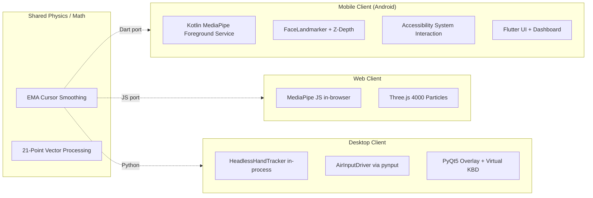
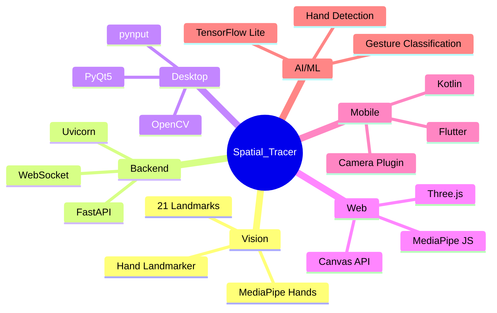
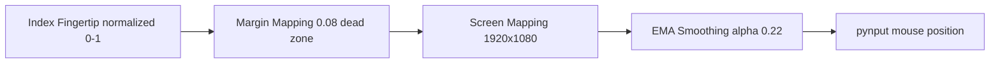
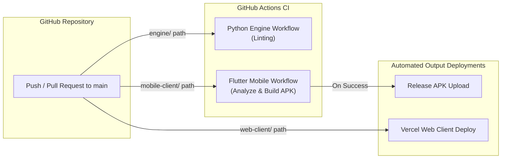

<div align="center">

# 🌌 `Spatial_Tracer`

**Next-Generation Multi-Platform Air Gesture Control System**

[](LICENSE)
[](https://python.org)
[](https://flutter.dev)
[](https://mediapipe.dev)
[](https://riverbankcomputing.com)
[](https://github.com/RajTewari01/Spatial_tracer/actions/workflows/python-engine.yml)
[](https://github.com/RajTewari01/Spatial_tracer/actions/workflows/flutter-mobile.yml)

<br>

*Typing. Scrolling. Clicking. Swiping.*  
**Control your entire Operating System with nothing but the air between your hands.**  
*Zero Hardware. Zero Gloves. Zero Latency.*

---

</div>

## 🌟 The Vision

`Spatial_Tracer` represents a leap in Human-Computer Interaction (HCI). It is a highly optimized, cross-platform kinematic engine that translates raw real-time camera feeds into complex Operating System inputs using pure algorithmic heuristics. 

By analyzing **21 independent 3D hand joints** and mapping out **478 facial micro-landmarks** simultaneously at 60Hz, it allows you to literally drag-and-drop the digital world around you.

### Platform Matrix

The engine effortlessly spans three unique ecosystems:

| Ecosystem | Technological Stack | Primary Functionality |
| :--- | :--- | :--- |
| 🌐 **Web Protocol** | `MediaPipe WebAssembly` · `Three.js` | Zero-install interactive playground boasting a 4000-particle physics engine avoiding your hands in 3D space. |
| 💻 **Desktop Kernel** | `Python 3` · `PyQt5` · `pynput` · `win32api` | Frameless, transparent hovering glassmorphic Virtual Keyboard capturing precise mid-air keystrokes and native OS mouse events. |
| 📱 **Android Service** | `Flutter` · `Kotlin Platform Channels` | Indestructible Android Accessibility Foreground Service mapping head tilts to infinite TikTok scrolls and eye blinks to OS multitasking. |

---

## Architecture



### Component Breakdown
- **Input (Camera Stream)**: Grabs frames continuously at native webcam/phone camera resolution.
- **AI Models (MediaPipe)**: We leverage lightweight MediaPipe task vision models. `HandLandmarker` yields 21 3D points per hand, while `FaceLandmarker` maps 478 micro points on the face.
- **Processing Engine**: The core logic layer that translates raw 3D vectors into semantic meanings. It calculates finger joint angles, face tilt pitch/yaw, and eye aspect ratio (EAR).
- **OS Interaction**: Acts as the driver layer bridging gesture intent to actual host system commands (using `pynput` for virtual clicks on Desktop, and Accessibility Services on Mobile).

---

## System Flow



---

## Gesture Map

### ✋ Hand Gestures
```text
┌────────────────────────────────────────────────────────┐
│  GESTURE         │  ACTION            │  MODULE        │
├──────────────────┼────────────────────┼────────────────┤
│  POINTING        │  Move cursor       │  Desktop/Mobile│
│  PINCH           │  Go Back           │  Mobile        │
│  PINCH           │  Left click / Type │  Desktop       │
│  PEACE           │  Tap / Click       │  Desktop/Mobile│
│  FIST            │  Recent Apps       │  Mobile        │
│  THUMBS UP/DOWN  │  Scroll / Return   │  Desktop/Mobile│
└──────────────────┴────────────────────┴────────────────┘
```

### 👁️ Face Gestures (Mobile Only)
```text
┌────────────────────────────────────────────────────────┐
│  GESTURE         │  ACTION            │  TRIGGER       │
├──────────────────┼────────────────────┼────────────────┤
│  HEAD TILT UP    │  Scroll Up         │  Z-Depth Pitch │
│  HEAD TILT DOWN  │  Scroll Down       │  Z-Depth Pitch │
│  HEAD TILT LEFT  │  Swipe Left        │  Z-Depth Yaw   │
│  HEAD TILT RIGHT │  Swipe Right       │  Z-Depth Yaw   │
│  FIRM BLINK      │  Recent Apps/Close │  EAR < 0.22    │
└──────────────────┴────────────────────┴────────────────┘
```

---

## ✨ Virtual Keyboard (Desktop)

The desktop client includes a **premium glassmorphic virtual keyboard** that you can type on using gestures in mid-air.

| Feature | Description |
|---------|-------------|
| **Two-Hand Tracking** | Use both hands simultaneously. Hold `SHIFT` or `CTRL` with one hand and type a letter with the other (`Ctrl+C`, etc). |
| **Hover & Target** | Pointing (`PEACE` or `POINTING` gesture) moves a glowing finger cursor over the keys. |
| **Air-Typing** | `PINCH` a key to type it (features a visual flash and cooldown to prevent double-typing). |
| **Quick Clear** | `PINCH` and hold the `DEL` or `BACKSPACE` key for **4 seconds** to trigger a `Ctrl+A` → `Delete` macro, clearing all text instantly. |

---

## Gesture Detection Pipeline



---

## Project Structure

```
spatial_tracer/
│
├── engine/                          # Core processing
│   ├── headless_hand_tracer.py      # MediaPipe Tasks API tracker
│   ├── simple_hand_tracer.py        # OpenCV debug view with skeleton
│   ├── gesture_detector.py          # Pinch, tap, swipe, palm detection
│   └── air_input_driver.py          # pynput mouse/keyboard control
│
├── api/                             # Server layer
│   ├── fastapi_main.py              # FastAPI + WebSocket server
│   └── input_controller.py          # Keyboard input via pynput
│
├── web-client/                      # Browser client
│   ├── index.html                   # Premium dark UI
│   ├── style.css                    # Pitch-black dev theme
│   └── app.js                       # MediaPipe JS + Three.js + gestures
│
├── desktop-client/                  # PyQt5 overlay
│   ├── app.py                       # Transparent overlay + camera panel
│   └── camera_widget.py             # Hand skeleton renderer
│
├── mobile-client/                   # Flutter Android
│   ├── lib/main.dart                # Full app (camera, gestures, UI)
│   ├── android/.../MainActivity.kt  # MediaPipe Kotlin platform channel
│   └── pubspec.yaml                 # Dependencies
│
├── config/
│   ├── hand_landmarker.task         # MediaPipe model weights
│   └── mapping.json                 # Key mapping config
│
├── main.py                          # CLI entry point
├── requirements.txt                 # Python dependencies
└── LICENSE                          # MIT
```

---

## Multi-Platform Architecture



---

## Quick Start

### Prerequisites

```bash
Python 3.10+
Flutter 3.x (for mobile)
Webcam / Camera
```

### Install

```bash
git clone https://github.com/RajTewari01/Spatial_tracer.git
cd Spatial_tracer
pip install -r requirements.txt
```

### Run

```bash
# Web client — open in browser with 3D particle demo
python main.py web

# Desktop — transparent overlay, real mouse/keyboard control
python main.py desktop

# Debug — OpenCV window with hand skeleton
python main.py debug

# Android — Flutter app
cd mobile-client && flutter run
```

---

## Tech Stack



---

## Gesture Detection — How It Works

The system uses a **two-phase approach**:

### Phase 1: Finger State Analysis

Each of the 5 fingers is classified independently:

| State | Condition | Description |
|-------|-----------|-------------|
| **Extended** | `tip.y < MCP.y` | Fingertip is above its knuckle |
| **Folded** | `tip.y > PIP.y` | Fingertip is below its middle joint |
| **Ambiguous** | Between | Partially bent — ignored to prevent false triggers |

For the **thumb**, lateral distance from the index MCP is used instead of Y-axis comparison.

### Phase 2: Pattern Matching with Priority

Gestures are checked **most-specific first**. If a specific gesture matches (like PEACE), the catch-all gestures (FIST, OPEN_PALM) are **blocked** from firing. This prevents the domination problem where generic gestures override specific ones.

A **2-frame stability buffer** prevents single-frame noise from triggering false gestures.

---

## Desktop Air Input — How Mouse Control Works



- **Smoothing**: Exponential Moving Average prevents cursor jitter
- **Margin**: 8% dead zone at screen edges for comfortable use
- **Cooldowns**: 400ms click, 150ms scroll, 500ms key — prevents accidental repeats

---

## Configuration

| Parameter | Default | Description |
|-----------|---------|-------------|
| `smoothing` | `0.4` | Cursor smoothing (0=raw, 1=frozen) |
| `margin` | `0.1` | Screen edge dead zone |
| `click_cooldown` | `0.4s` | Min time between clicks |
| `scroll_cooldown` | `0.15s` | Min time between scrolls |
| `key_cooldown` | `0.5s` | Min time between key presses |
| `modelComplexity` | `0` | MediaPipe model (0=fast, 1=accurate) |
| `maxNumHands` | `2` | Max hands to track |

---

## API Endpoints

| Endpoint | Method | Description |
|----------|--------|-------------|
| `/` | GET | Serves the web client |
| `/ws/hand-data` | WebSocket | Real-time hand landmark stream |
| `/status` | GET | Server status + active connections |

---

## 🚀 CI/CD Pipelines & Workflows

Spatial_Tracer utilizes GitHub Actions to ensure code quality and build integrity across all platforms.



Our continuous integration pipelines are configured in `.github/workflows/`:
1. **Python Engine CI (`python-engine.yml`)**: Checks Python 3.10 syntax integrity across the API, Desktop Client, and Engine backend using `flake8`, maintaining coding standards and preventing syntax errors in the core logic.
2. **Flutter Mobile CI (`flutter-mobile.yml`)**: Verifies the Dart/Flutter codebase through analytical lint checks (`flutter analyze`), and performs a full release build (`flutter build apk`), producing downloadable Android APK artifacts automatically.
3. **Web Client**: Integrates directly with Vercel for continuous deployment, ensuring web-based UI modifications instantly go live.

---

## 📚 Comprehensive Wiki

For deep-dive documentation into every corner of this project, we have fully documented the engine in our [Project Wiki](wiki/Home.md).

- [Architecture Deep Dive](wiki/Architecture-Deep-Dive.md): Mathematical formulas for finger bend detections, EMA smoothing logic.
- [Python Engine & Desktop](wiki/Python-Engine-&-Desktop.md): Detailed internals of `pynput` and `PyQt5` glassmorphism.
- [Mobile Client Integration](wiki/Flutter-Mobile-Client.md): Understanding the Kotlin-to-Dart platform channels and Accessibility API.
- [CI/CD Workflows](wiki/CI-CD-Workflows.md): Infrastructure-as-code documentation.

---

## Contributing

```bash
# Fork → Clone → Branch → Code → PR
git checkout -b feat/your-feature
# Make changes
git commit -m "feat: description"
git push origin feat/your-feature
```

---

## Roadmap

- [ ] Voice commands integration
- [ ] Multi-hand collaborative gestures
- [ ] Custom gesture training (record your own)
- [ ] Accessibility mode for motor-impaired users
- [ ] iOS Flutter client
- [ ] Electron desktop app

---

<div align="center">

**Built by [Biswadeep Tewari](https://github.com/RajTewari01)**

*Full-Stack & AI/ML Engineer · Python · Dart · Kotlin · JS*
*MAKAUT University, West Bengal*

`build > ship > learn > repeat`

---

MIT License · 2025-2026

</div>
