<div align="center">

# 🌌 `Spatial_Tracer`

**Next-Generation Multi-Platform Air Gesture Control System**

[](LICENSE)
[](https://python.org)
[](https://flutter.dev)
[](https://mediapipe.dev)
[](https://riverbankcomputing.com)
[](https://github.com/RajTewari01/Spatial_tracer/actions/workflows/python-engine.yml)
[](https://github.com/RajTewari01/Spatial_tracer/actions/workflows/flutter-mobile.yml)
[](https://github.com/RajTewari01/Spatial_tracer/actions/workflows/web-client.yml)
[](https://github.com/RajTewari01/Spatial_tracer/actions/workflows/security-audit.yml)
[](https://github.com/RajTewari01/Spatial_tracer/actions/workflows/docs-integrity.yml)

<br>

*Typing. Scrolling. Clicking. Swiping.*  
**Control your entire Operating System with nothing but the air between your hands.**  
*Zero Hardware. Zero Gloves. Zero Latency.*

---

</div>

## 🎬 Live Proof — See It In Action

> *No simulations. No mockups. Real screenshots and recordings from physical devices running the Spatial_Tracer engine.*

### 📱 Mobile Client

<div align="center">
<table>
<tr>
<td align="center"><b>App Front Page</b><br><br>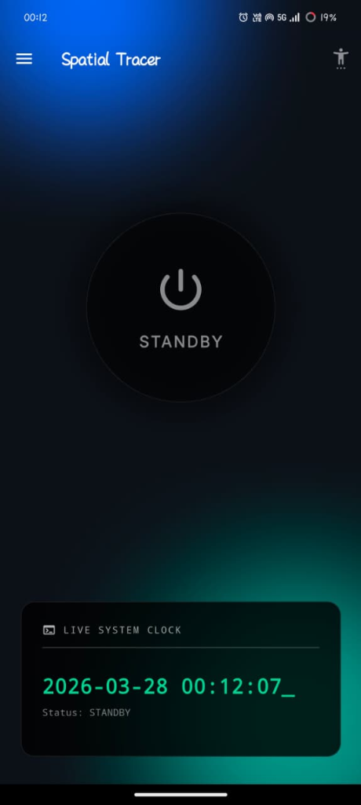</td>
<td align="center"><b>In-App Tutorial</b><br><br>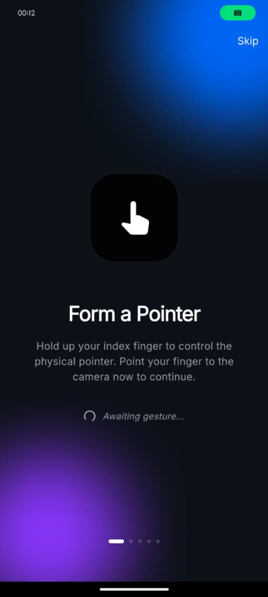</td>
<td align="center"><b>Dashboard</b><br><br>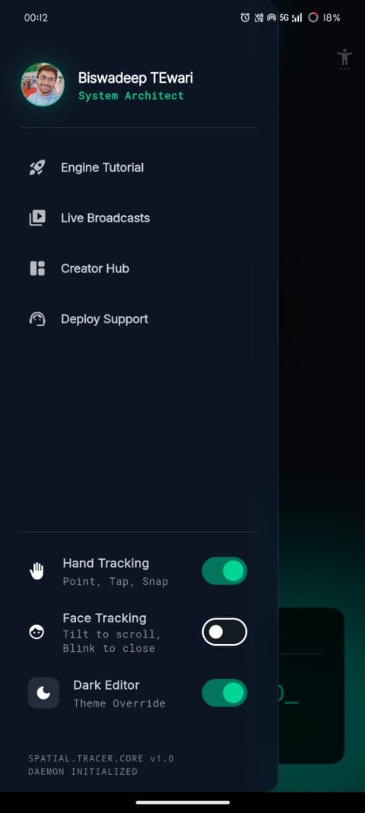</td>
<td align="center"><b>My Profile</b><br><br>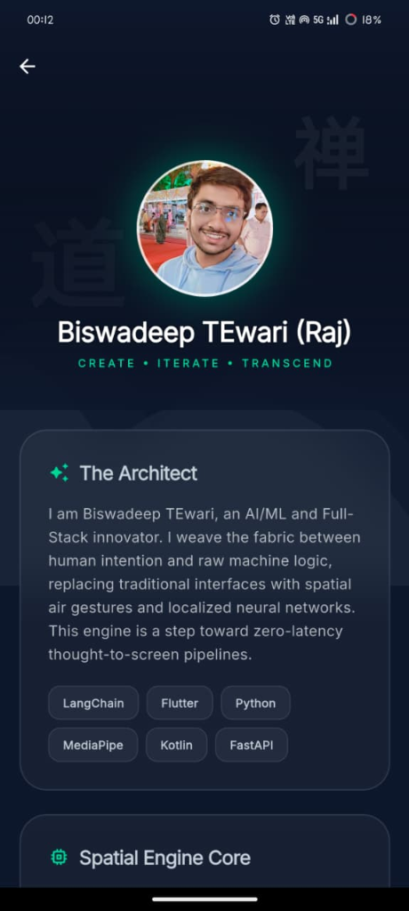</td>
</tr>
</table>
</div>

### 🖥️ Desktop & Web

<div align="center">
<table>
<tr>
<td align="center" width="60%"><b>Desktop Overlay — Live Gesture Control</b><br><br>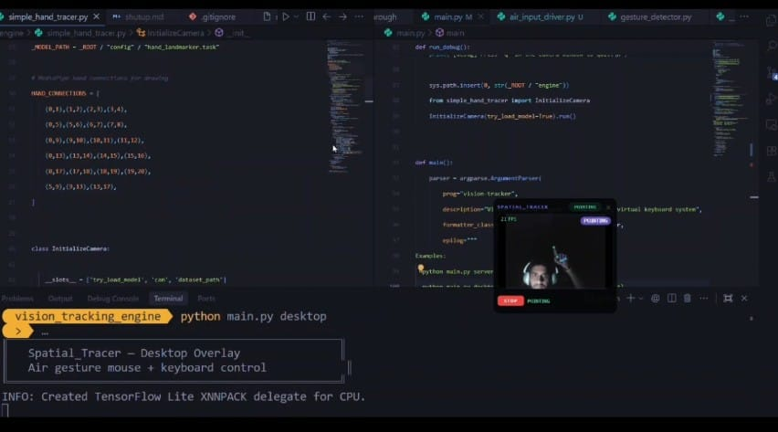</td>
<td align="center" width="40%"><b>Web Client — 3D Particle Engine</b><br><br>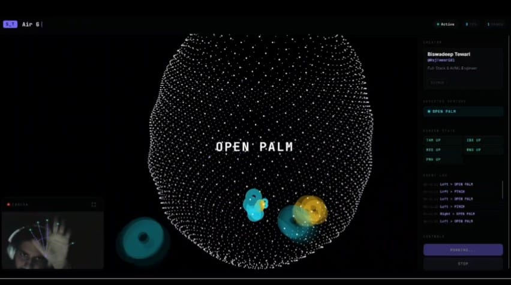</td>
</tr>
</table>
</div>

### 🎥 Video Demos *(click to play — silenced)*

**👁️ Blink Detection — Desktop**

https://github.com/RajTewari01/Spatial_tracer/raw/main/proofs/blink_scroll_control.mp4

**🌐 Web 3D Simulation**

https://github.com/RajTewari01/Spatial_tracer/raw/main/proofs/air_cursor_navigation.mp4

**🖐️ Hand Gestures — Android**

https://github.com/RajTewari01/Spatial_tracer/raw/main/proofs/full_system_walkthrough.mp4

**😊 Blink & Scroll Control**

https://github.com/RajTewari01/Spatial_tracer/raw/main/proofs/gesture_tracking_demo.mp4

---

## 🌟 The Vision

`Spatial_Tracer` is a cross-platform kinematic control engine that converts live camera feeds into real Operating System inputs — mouse movement, keyboard presses, scrolling, and Android navigation — using pure algorithmic heuristics. No ML classifiers. No training data. Just geometry.

The engine analyzes **21 independent 3D hand joints** via MediaPipe and maps them against **478 facial micro-landmarks** simultaneously at native camera FPS, enabling you to control any device with nothing but air gestures.

---

## 🏗️ System Architecture

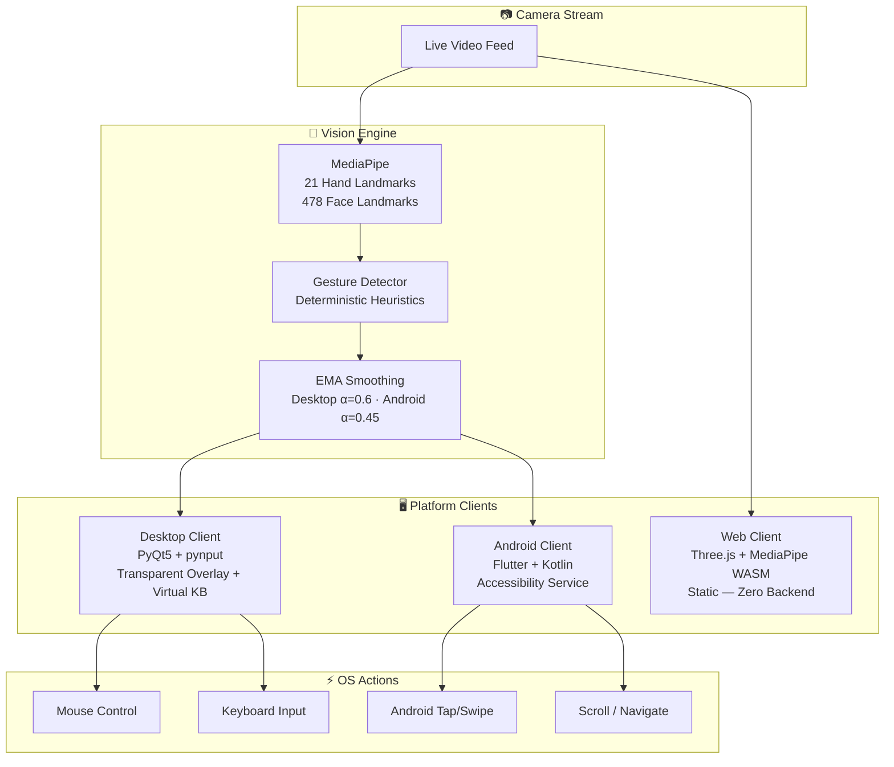

> **Critical distinction:** The Web Client runs 100% in-browser using MediaPipe WASM — it does **not** connect to the Python server. Desktop and Mobile are completely independent executables. All three share the same gesture detection *algorithm* but implement it in their own language (Python, Kotlin, JavaScript).

---

## 🌐 Three Independent Platforms

| Platform | Stack | How It Runs | Connects to Python Server? |
|:---------|:------|:------------|:---------------------------|
| 🖥️ **Desktop** | Python 3.10 · PyQt5 · pynput · OpenCV | `python main.py desktop` | ❌ Runs in-process |
| 📱 **Android** | Flutter 3.x · Kotlin · Google ML Kit | `flutter run` (APK) | ❌ Fully standalone |
| 🌐 **Web** | Three.js · MediaPipe WASM · Vanilla JS/CSS | Open in browser (Vercel) | ❌ 100% client-side |
| 🔌 **API Server** | FastAPI · Uvicorn · WebSocket | `python main.py server` | — *It IS the server* |

---

## 📁 Repository Structure

```
Spatial_tracer/
│
├── main.py                          # CLI entry point (server/desktop/web/debug)
├── requirements.txt                 # Python dependencies
├── vercel.json                      # Vercel deploy config (routes to web-client/)
├── LICENSE                          # MIT
│
├── engine/                          # 🧠 Core Vision Engine (Python)
│   ├── __init__.py                  # Exports HeadlessHandTracker, GestureDetector
│   ├── simple_hand_tracer.py        # OpenCV debug view — renders skeleton on camera
│   ├── headless_hand_tracer.py      # Headless tracker — yields frame data (no GUI)
│   ├── gesture_detector.py          # Deterministic gesture classification (13 gestures)
│   └── air_input_driver.py          # Translates gestures → OS inputs (pynput)
│
├── api/                             # 🔌 FastAPI Server
│   ├── __init__.py
│   ├── fastapi_main.py              # WebSocket streaming + REST endpoints
│   └── input_controller.py          # Remote keystroke injection via pynput
│
├── desktop-client/                  # 🖥️ PyQt5 Desktop Overlay
│   ├── app.py                       # Frameless transparent window + gesture HUD
│   ├── camera_widget.py             # Embedded camera feed with landmark drawing
│   └── virtual_keyboard.py          # Floating air keyboard (maps fingertip to keys)
│
├── config/
│   ├── hand_landmarker.task         # MediaPipe TFLite model (7.8 MB)
│   └── mapping.json                 # Virtual keyboard layout (69 keys, QWERTY)
│
├── mobile-client/                   # 📱 Flutter + Kotlin Android App
│   ├── pubspec.yaml                 # Flutter deps (camera, google_mlkit, provider, shared_prefs)
│   ├── lib/
│   │   ├── main.dart                # 37KB — App entry, onboarding flow, dashboard, settings UI
│   │   ├── theme.dart               # Dark/Light theme definitions (emerald accent)
│   │   └── screens/
│   │       └── creator_profile.dart # 17KB — Developer profile with glassmorphic cards
│   ├── android/app/src/main/kotlin/com/rajtewari/spatial_tracer_mobile/
│   │   ├── MainActivity.kt          # Flutter↔Kotlin MethodChannel + EventChannel bridge
│   │   ├── TrackerService.kt        # 437-line LifecycleService (CameraX + MediaPipe LIVE_STREAM)
│   │   ├── GestureDetector.kt       # Hand gesture classifier (Kotlin port)
│   │   ├── FaceDetector.kt          # Face EAR blink + Z-depth tilt detection
│   │   ├── CursorOverlay.kt         # System overlay — draws cursor on screen
│   │   └── SpatialAccessibilityService.kt  # AccessibilityService for OS-level taps/swipes
│   └── test/
│       └── widget_test.dart         # Basic render smoke test
│
├── web-client/                      # 🌐 Static Web Client (Vercel-deployed)
│   ├── index.html                   # Entry HTML — loads Three.js + MediaPipe CDN
│   ├── app.js                       # Gesture detection + 4000-particle sphere physics
│   └── style.css                    # Glassmorphic dark theme
│
├── proofs/                          # 🎬 Live proof screenshots & demo recordings
│
├── wiki/                            # 📚 Deep-dive documentation
│
└── .github/workflows/               # ⚙️ CI/CD Pipelines
    ├── python-engine.yml            # flake8 syntax linting
    ├── flutter-mobile.yml           # flutter analyze + build APK
    └── web-client.yml               # jshint + file integrity checks
```

---

## 🚀 Getting Started

### Platform A: Desktop Client (Windows)

> Runs a transparent PyQt5 overlay with an air-controlled cursor and floating virtual keyboard.

**Requirements:** Python 3.10+, webcam, Windows OS (required for `pynput`/`win32api`)

```bash
# 1. Clone
git clone https://github.com/RajTewari01/Spatial_tracer.git
cd Spatial_tracer

# 2. Create virtual environment (recommended)
python -m venv venv
.\venv\Scripts\activate

# 3. Install dependencies
pip install -r requirements.txt

# 4. Run — choose your mode:
python main.py desktop    # Transparent overlay with air cursor + virtual keyboard
python main.py debug      # OpenCV window showing hand skeleton (for development)
python main.py server     # FastAPI server only (WebSocket at ws://localhost:8765/ws/hand-data)
python main.py web        # Start server + auto-open web client in browser
```

| CLI Mode | What It Launches |
|----------|-----------------|
| `desktop` | PyQt5 transparent overlay → cursor follows index finger, peace sign = click, fist = right-click |
| `debug` | Raw OpenCV window with drawn hand skeleton — press `q` to quit |
| `server` | FastAPI on `http://localhost:8765` — streams via WebSocket, serves web client at `/` |
| `web` | Same as `server` but auto-opens your browser to `localhost:8765` |

---

### Platform B: Android Mobile App (Flutter)

> A standalone Flutter app with native Kotlin camera processing. Does NOT require the Python server.

**Requirements:** Flutter 3.x, Android SDK, Java 17, physical Android device (camera required)

```bash
# 1. Navigate to mobile client
cd mobile-client

# 2. Install Flutter dependencies
flutter pub get

# 3. Connect your Android device via USB (enable Developer Options + USB Debugging)

# 4. Build & install
flutter run                        # Debug build — hot reload enabled
flutter build apk --release        # Production APK → build/app/outputs/flutter-apk/app-release.apk
```

**Android Permissions Required:**
- 📷 **Camera** — for hand/face tracking via Google ML Kit
- 🖥️ **Overlay** — draws the air cursor on top of all apps
- ♿ **Accessibility Service** — enables system-wide tap/swipe injection (required for TikTok scrolling, app switching, etc.)

**Architecture:** Flutter (Dart UI) ↔ `MethodChannel('com.rajtewari/hand_tracker')` ↔ Kotlin (Camera + ML Kit + Gesture Detector + CursorOverlay + AccessibilityService)

---

### Platform C: Web Client (Browser — Zero Install)

> A fully client-side Three.js + MediaPipe WASM experience. No server, no install, no backend.

**Live URL:** Deployed via Vercel — just open in any browser with a webcam.

```
🌐 The web client runs entirely in your browser.
   No Python server needed. No installation.
   MediaPipe loads as a WASM module from CDN.
```

**To run locally (optional):**
```bash
# Option 1: Use the FastAPI server to serve it
python main.py web

# Option 2: Any static file server works
cd web-client
npx serve .
# or: python -m http.server 3000
```

**What it includes:**
- 🖐️ Real-time hand tracking via MediaPipe Hands WASM (max 2 hands)
- 🌐 4,000-particle Three.js sphere with inverse-square repulsive force from fingertips
- ✨ 13 gesture types detected in real-time (peace, fist, rock, pinch, ok, etc.)
- 📊 Live FPS counter, finger state readout, event log panel
- 🎨 Typewriter animations, glassmorphic UI, OrbitControls

---

## 🖐️ Gesture Recognition Engine

All three platforms use the **same deterministic algorithm** — no machine learning classifiers. Gesture detection works by comparing normalized Y-coordinates of fingertip landmarks against their MCP/PIP joints:

```
Finger "extended":  tip.y < MCP.y   (tip is ABOVE the knuckle on screen)
Finger "curled":    tip.y > PIP.y   (tip is BELOW its own mid-joint)
Thumb:              |tip.x - ref.x| comparison (lateral distance from palm)
```

### Hand Gesture Map

| Gesture | Detection Rule | Desktop Action | Android Action |
|:--------|:---------------|:---------------|:---------------|
| **POINTING** | Index extended, others folded | Move cursor | Move cursor overlay (EMA smoothed) |
| **PEACE** ✌️ | Index + middle extended, ring + pinky folded (tip gap > 0.05) | Left click / double-click | Tap at cursor position (600ms cooldown) |
| **FIST** ✊ | All 5 fingers curled | Right click | Recent Apps (1000ms cooldown) |
| **OPEN PALM** 🖐️ | All 5 fingers extended | Stop / idle | Stop / idle |
| **THUMBS UP** 👍 | Only thumb extended, tip > 0.04 above palm center | Scroll up / Enter key | Swipe up (500ms cooldown) |
| **THUMBS DOWN** 👎 | Only thumb extended, tip > 0.04 below palm center | Scroll down / Backspace | Swipe down (500ms cooldown) |
| **PINCH** 🤏 | Thumb tip touching index tip (dist < 0.05) | Drag start / Left click | Go Back (1000ms cooldown) |
| **OK** 👌 | Thumb-index touch + middle/ring/pinky extended | — | — |
| **ROCK** 🤘 | Index + pinky extended, middle + ring folded | — | — |
| **CALL ME** 🤙 | Thumb + pinky extended, others folded | — | — |
| **THREE** | Index + middle + ring extended, thumb + pinky folded | Tab key | Go Home (1000ms cooldown) |
| **SPIDERMAN** 🕷️ | Thumb + index + pinky extended, middle + ring folded | — | — |
| **MIDDLE FINGER** | Only middle extended, others folded | — | — |

### Face Gesture Map (Android & Desktop)

| Gesture | Detection Method | Threshold | Action |
|:--------|:-----------------|:----------|:-------|
| **TILT UP** | Z-depth: chin.z - forehead.z < -0.045 | 3 stable frames | Scroll up |
| **TILT DOWN** | Z-depth: chin.z - forehead.z > 0.045 | 3 stable frames | Scroll down |
| **TILT LEFT** | Z-depth: rightCheek.z - leftCheek.z < -0.045 | 3 stable frames | Swipe left |
| **TILT RIGHT** | Z-depth: rightCheek.z - leftCheek.z > 0.045 | 3 stable frames | Swipe right |
| **FIRM BLINK** | EAR (Eye Aspect Ratio) < 0.22 | 3 stable frames | Close / Recent Apps |

### Stability Buffer

All gestures pass through a **frame stability filter** before triggering:
- **Hand gestures:** 2 consecutive frames required (all platforms)  
- **Face gestures:** 3 consecutive frames required (Android `FaceDetector.kt`)  
- **Frame alternation:** When both hand + face tracking are active on Android, frames alternate between detectors (`frameCounter % 2`) to prevent GPU overload
- **Desktop cooldowns:** 400ms click, 150ms scroll, 500ms key
- **Android cooldowns:** 600ms tap (PEACE), 1000ms back/recents/home, 500ms scroll, 1500ms blink
- **Web cooldown:** 1200ms gesture flash display

---

## 🖥️ Desktop — Cursor Pipeline Deep Dive

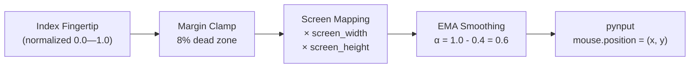

| Pipeline Stage | Code Location | Details |
|:---------------|:-------------|:--------|
| Landmark extraction | `engine/headless_hand_tracer.py` | MediaPipe TFLite model — default 1280×720, desktop override 640×480 |
| Gesture classification | `engine/gesture_detector.py` | 13 gestures, `tip.y < MCP.y` heuristic |
| Cursor smoothing | `engine/air_input_driver.py` | `new = prev + α × (raw − prev)` where α = 1.0 − smoothing (desktop: 0.6) |
| OS input injection | `engine/air_input_driver.py` | `pynput.mouse.Controller()` + `pynput.keyboard.Controller()` |
| Virtual keyboard | `desktop-client/virtual_keyboard.py` | 69-key QWERTY layout, `PINCH` gesture hit-tests fingertip midpoint against key grid, 4s long-press DEL/BACK = select-all + delete |
| Transparent overlay | `desktop-client/app.py` | 814-line PyQt5 app: frameless `Qt.WindowStaysOnTopHint \| Qt.Tool`, `WA_TranslucentBackground`, 300×280px panel, draggable, camera minimizable. Uses `ctypes.windll.user32.GetSystemMetrics` for screen resolution |

---

## 📱 Android — Kotlin Native Architecture

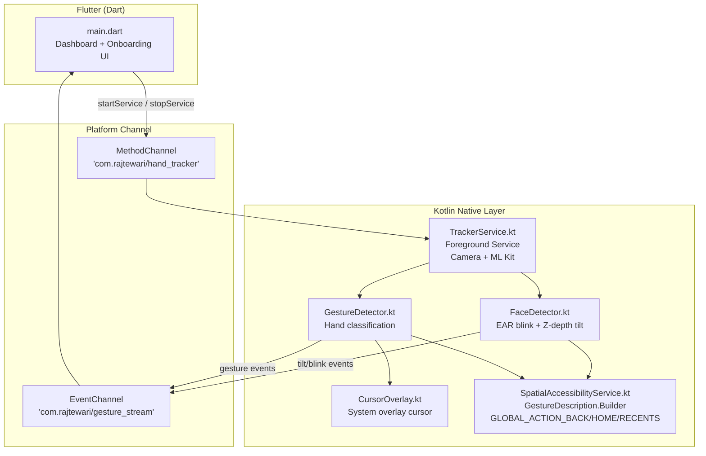

| Kotlin File | Responsibility |
|:------------|:--------------|
| `MainActivity.kt` | Receives Flutter MethodChannel calls, starts/stops `TrackerService`, checks overlay + accessibility permissions |
| `TrackerService.kt` | 437-line `LifecycleService` — opens CameraX front camera, runs MediaPipe HandLandmarker + FaceLandmarker in `LIVE_STREAM` mode, alternates hand/face frames when both active, dispatches results to GestureDetector/FaceDetector, applies EMA smoothing (α=0.45), sends gesture events to Flutter via `EventChannel` |
| `GestureDetector.kt` | Kotlin `object` singleton — classifies 21 landmarks using `tip.y < MCP.y` (same algorithm as Python). 10 gestures, pinch threshold `< 0.05`, peace requires tip gap `> 0.05`, `STABLE_FRAMES = 2` |
| `FaceDetector.kt` | Computes EAR blink (< 0.22 threshold) and 3D Z-depth pitch/yaw for head tilts |
| `CursorOverlay.kt` | Draws a system overlay cursor (`WindowManager.LayoutParams.TYPE_APPLICATION_OVERLAY`) that follows fingertip position |
| `SpatialAccessibilityService.kt` | Dispatches fake touch events via `GestureDescription.Builder()` + `StrokeDescription(Path(), 0, 100)` and system nav via `performGlobalAction(GLOBAL_ACTION_BACK/HOME/RECENTS)`. Swipes use normalized→pixel coordinate mapping |

---

## 🌐 Web Client — Three.js Particle Physics

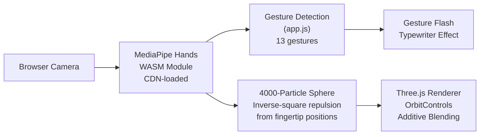

**Key constants (from `app.js`):**
- Particle count: `4000` vertices on a golden-ratio sphere (radius 1.6)
- Repulsion radius: `2.2` units — particles flee from fingertips
- Repulsion force: `Math.pow(Math.max(0, 1 - d/2.2), 2) * 0.9` (inverse square)
- Trail particles: spawned every 3rd frame for index + thumb only (max 80)
- Gesture stability: 2 consecutive frames required before trigger

---

## 🔌 API Server Endpoints

The FastAPI server is optional — only needed for the `web` and `server` CLI modes.

| Endpoint | Method | Description |
|:---------|:-------|:------------|
| `/` | GET | Serves `web-client/index.html` |
| `/app.js` | GET | Serves the JavaScript bundle |
| `/style.css` | GET | Serves the CSS stylesheet |
| `/ws/hand-data` | WebSocket | Streams JSON frames at ~30 FPS: `{ timestamp, fps, hands, gestures }` |
| `/start` | POST | Starts the headless hand tracker in a background thread |
| `/stop` | POST | Stops the tracker and releases the camera |
| `/status` | GET | Returns `{ running, fps, connected_clients }` |
| `/press-key` | POST | Injects a keystroke via pynput: `{ "key": "A" }` |

---

## ⚙️ Configuration Reference

### Desktop Engine (`air_input_driver.py` defaults, overridden in `app.py`)

| Parameter | Driver Default | Desktop Override | Description |
|:----------|:--------------|:-----------------|:------------|
| `smoothing` | `0.35` (α=0.65) | `0.4` (α=0.6) | EMA smoothing factor — lower = snappier, higher = smoother |
| `margin` | `0.08` (8%) | `0.1` (10%) | Screen edge dead zone |
| `click_cooldown` | `0.4s` | `0.4s` | Minimum time between left clicks |
| `scroll_cooldown` | `0.15s` | `0.15s` | Minimum time between scroll events |
| `key_cooldown` | `0.5s` | `0.5s` | Minimum time between virtual key presses |

### MediaPipe Settings

| Parameter | Desktop (Python) | Web (JS) | Android (Kotlin) |
|:----------|:----------------|:---------|:-----------------|
| `modelComplexity` | `1` (TFLite local) | `0` (WASM CDN) | ML Kit default |
| `maxNumHands` | `1` | `2` | `1` |
| `minDetectionConfidence` | `0.7` | `0.6` | ML Kit default |
| `minTrackingConfidence` | `0.5` | `0.5` | ML Kit default |

### Virtual Keyboard (`config/mapping.json`)

69 keys in standard QWERTY layout. Each key stores normalized screen coordinates:
```json
{ "label": "A", "x": 0.270, "y": 0.69, "w": 0.035, "h": 0.06 }
```

---

## ⚙️ CI/CD Pipelines

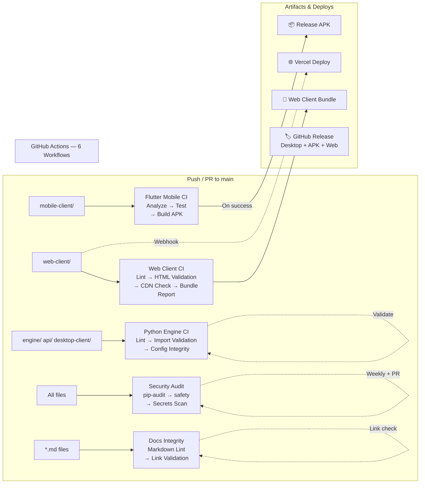

| Workflow | Runner | Triggers On | What It Does |
|:---------|:-------|:------------|:-------------|
| `python-engine.yml` | `windows-latest` | `engine/` `api/` `desktop-client/` `main.py` | flake8 lint → import validation (engine, api) → config file integrity (model size, keyboard keys) |
| `flutter-mobile.yml` | `ubuntu-latest` | `mobile-client/` | Dart analysis → unit tests → release APK build → APK size report → upload artifact |
| `web-client.yml` | `ubuntu-latest` | `web-client/` | jshint → HTML structure validation → CDN availability check → bundle size report → upload artifact |
| `security-audit.yml` | `ubuntu-latest` | All pushes/PRs + weekly | pip-audit + safety (Python deps) → flutter pub outdated → hardcoded secrets scan |
| `docs-integrity.yml` | `ubuntu-latest` | `*.md` files | Markdown lint → internal link validation → proof media inventory → docs coverage stats |
| `release.yml` | Multi-platform | `v*` tags | Parallel build (desktop zip + APK + web zip) → GitHub Release with all artifacts |
| **Vercel** | Managed | `web-client/` | Auto-deploy via GitHub webhook — routes defined in `vercel.json` |

---

## 📚 Wiki — Deep Dive Documentation

For comprehensive internals documentation, see the [Project Wiki](wiki/Home.md):

| Wiki Page | What It Covers |
|:----------|:---------------|
| [Architecture Deep Dive](wiki/Architecture-Deep-Dive.md) | Mathematical foundations: EMA smoothing, EAR blink formula, Z-depth pitch/yaw |
| [Python Engine & Desktop](wiki/Python-Engine-&-Desktop.md) | pynput driver internals, PyQt5 transparent overlay, virtual keyboard hit-testing |
| [Flutter Mobile Client](wiki/Flutter-Mobile-Client.md) | Kotlin platform channels, TrackerService lifecycle, AccessibilityService spoofing |
| [Web Client & API](wiki/Web-Client-&-API.md) | Three.js particle physics, WebSocket streaming protocol, MediaPipe WASM |
| [CI/CD Workflows](wiki/CI-CD-Workflows.md) | Pipeline architecture, runner configs, artifact outputs |
| [Integrity Report](wiki/Integrity-Report.md) | Code audit — verifying docs match actual thresholds in source |

---

## 🗺️ Roadmap

- [ ] Voice commands integration (Whisper)
- [ ] Multi-hand collaborative gestures
- [ ] Custom gesture training UI (record & save your own)
- [ ] Accessibility mode for motor-impaired users
- [ ] iOS Flutter client
- [ ] Electron desktop app (cross-platform)

---

## 🤝 Contributing

```bash
# 1. Fork the repository
# 2. Clone your fork
git clone https://github.com/<your-username>/Spatial_tracer.git

# 3. Create a feature branch
git checkout -b feat/your-feature

# 4. Make changes and commit
git commit -m "feat: description of your change"

# 5. Push and open a Pull Request
git push origin feat/your-feature
```

---

<div align="center">

**Built by [Biswadeep Tewari](https://github.com/RajTewari01)**

*Full-Stack & AI/ML Engineer · Python · Dart · Kotlin · JS*
*MAKAUT University, West Bengal*

`build it before they taught it`

---

MIT License · 2025-2026

</div>
